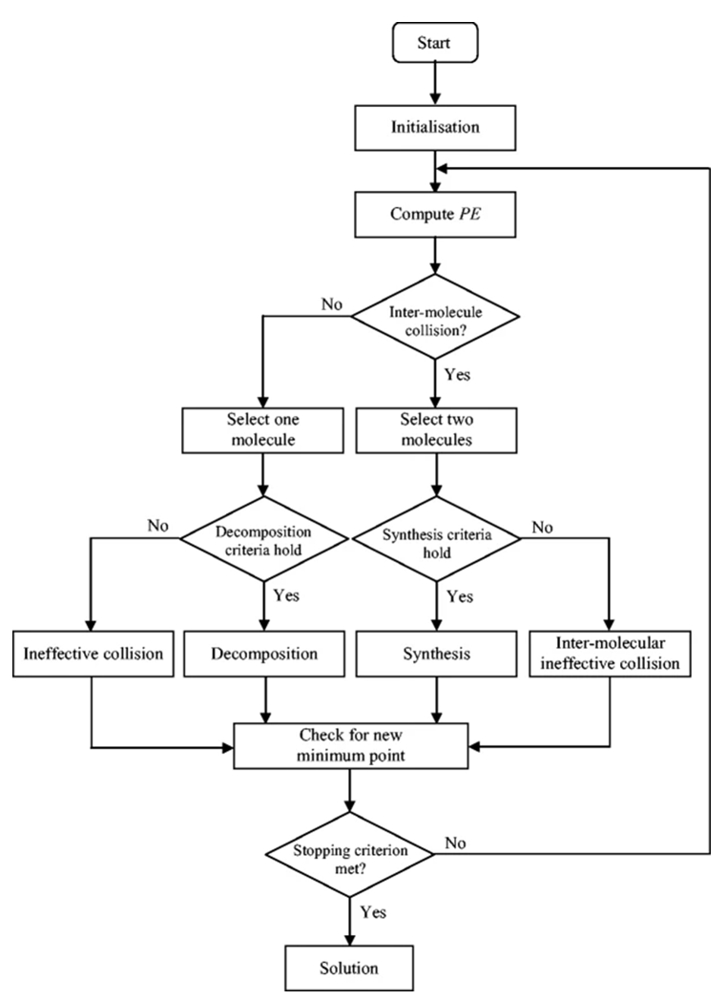

# algorithm_analysis_project
## IMCRO Algorithm




#### Input Of The algorithm 
``` python
class MoleCule:
    def __init__(self, structure: List[float] ,supersequence: List[int]) -> None:
        '''
            PE : Potential Energy (This is the number we focus on during the algorithm)

            structure : Molecule Structe store as 1d array with 2 elements ge
                generated randomly (For example: [0.3860863116352774 0.4017794415965995])

        '''
        self.pe = 0
        self.ke = 0
        self.opt = 9999999
        self.num_of_hits = 0
        self.structure = copy.deepcopy(structure)
        self.supersequence = copy.deepcopy(supersequence)

    def update(self) -> None:
        """
        This is called whenever a Operator is performed
        If this molecule has a lower energy, reset num_of_hits.
        """
        if self.pe < self.opt:
            self.opt = self.pe
            self.num_of_hits = 0
    def __str__(self) -> str:
        reVal = 'Structure'
        reVal +='[ '
        for i in self.structure:
            reVal+=str(i)+" "
        reVal +=']  Supersequence[ '
        for i in self.supersequence:
            reVal+=str(i)+" "
        reVal +=' ]'
        return reVal
```

## Initialization Stage
```Python
molecules=initialization(20,['acg', 'cat', 'gtt','tgc'])
# 0 1 2 | 1 0 3 | 2 3 3 | 3 2 1
for i in molecules:
    print(i)
```
> Structure[ 0.7451264037200714 0.14862620903354973 ]  Supersequence[ 3 0 2 1 1 1 2 0 3 2 3 3  ]
> Structure[ 0.6612169752322746 0.5253591314904629 ]  Supersequence[ 1 2 3 0 0 3 3 2 1 2  ]
Structure[ 0.3214577235550663 0.09673474104075352 ]  Supersequence[ 0 1 0 2 1 3 2 3 3 3 2 1  ]
Structure[ 0.7369880605321287 0.16935310798021386 ]  Supersequence[ 1 0 0 1 2 2 3 2 3 3 1  ]
Structure[ 0.15007207867716787 0.298249824513654 ]  Supersequence[ 3 2 0 1 1 1 2 0 3 3 3  ]
Structure[ 0.8601186062025266 0.9672356821408452 ]  Supersequence[ 2 1 3 3 0 0 1 3 3 2 2 1  ]
Structure[ 0.3890588910648719 0.8592251320333434 ]  Supersequence[ 0 1 2 1 0 3 3 2 3 2 3 1  ]
Structure[ 0.429657080115429 0.42090290863376345 ]  Supersequence[ 0 2 3 3 1 2 1 0 2 3  ]
Structure[ 0.1685640880758803 0.45404745280542547 ]  Supersequence[ 1 3 2 0 1 0 3 2 2 3 3 1  ]
Structure[ 0.2881701459894389 0.7140882415865242 ]  Supersequence[ 3 2 1 0 3 0 3 1 2 3 2 1  ]
Structure[ 0.02599515437836253 0.8941116566889885 ]  Supersequence[ 0 2 3 3 1 3 0 2 2 1 3  ]
Structure[ 0.49185238573118795 0.25024477343559126 ]  Supersequence[ 2 3 3 0 1 2 0 3 3 2 1  ]
Structure[ 0.29894093265469124 0.5895352429305613 ]  Supersequence[ 2 3 0 3 2 1 2 3 1 0 3  ]
Structure[ 0.3066898951061793 0.599932492760755 ]  Supersequence[ 0 1 0 2 3 3 2 3 2 1  ]
Structure[ 0.2913632895697338 0.47568232783685094 ]  Supersequence[ 2 3 3 3 0 1 2 1 0 3 2 1  ]
Structure[ 0.9181190296865294 0.8659732682753505 ]  Supersequence[ 1 3 2 3 2 3 0 0 1 2 1 3  ]
Structure[ 0.17765981035351996 0.7875672276197974 ]  Supersequence[ 3 0 1 2 1 0 2 3 1 3 3  ]
Structure[ 0.8039039809228474 0.7720475103900603 ]  Supersequence[ 0 3 1 2 0 2 2 3 3 1  ]
Structure[ 0.14370373637636125 0.8145166570904595 ]  Supersequence[ 0 2 1 2 3 1 2 3 1 0 3  ]
Structure[ 0.21351993415199944 0.518929683636179 ]  Supersequence[ 0 1 1 2 3 2 3 3 1 0 3  ]

### Compute PE
```python
    def __init__(self,pop : List[MoleCule],checkSeqeunce : List[List[int]]) -> None:
        '''
            Initialize the algorithm with this constructor 
            The parameter (Or the input) is the popsize which mean a List of Instance of Molecule Class
        '''
        self.pop=pop
        self.ops = Operators() # load in the operator for supersequence attribute of the molecule instance
        self.checkSeqeunce = checkSeqeunce

        for mol in self.pop:
            '''
                The fit_func function is self-defined based on the data
                In this example the PE formula is defined as math.sin(m.structure[0]) + math.cos(m.structure[1]) 
                Which i have deveried from this class
            '''
            mol.pe = self.fit_func(mol)
            mol.ke = self.init_ke
            mol.update()
            if self.optimal is None:
                self.optimal = copy.deepcopy(mol)
            elif mol.pe < self.optimal.pe:
                self.optimal = copy.deepcopy(mol)
```

## Iteration Stage
### Inter-molecule Coll
```python
    def run(self) -> None:
        '''
            The Algorithm starts here
            randomly pick which reaction uni(randomly take 1 molecule from popsize) 
            or inter (randomly take 2 molecule from popsize) 

            The number of iteration is abritrary 
        '''
        i=0
        while i!=1000:
            i+=1
            t = random.random()
            if t > self.moleColl or len(self.pop) < 2:
                self.uni_moleReact()
            else :
                self.inter_moleReact()
```
### Check for new point minium 
```python
    def update(self, m : MoleCule) -> None:
        """
            If m is the current optimal solution, save it to the optimal. 
            This is called after an operator is executed
        """
        if m.pe < self.optimal.pe and is_supersequence(m.supersequence):
            self.optimal = copy.deepcopy(m)
```